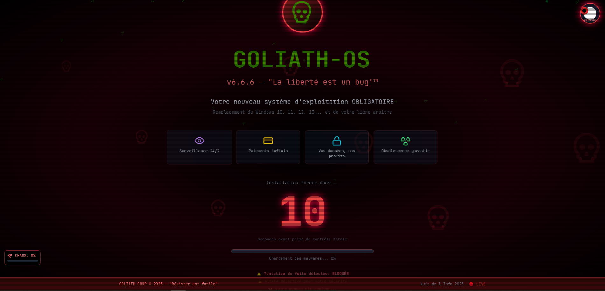
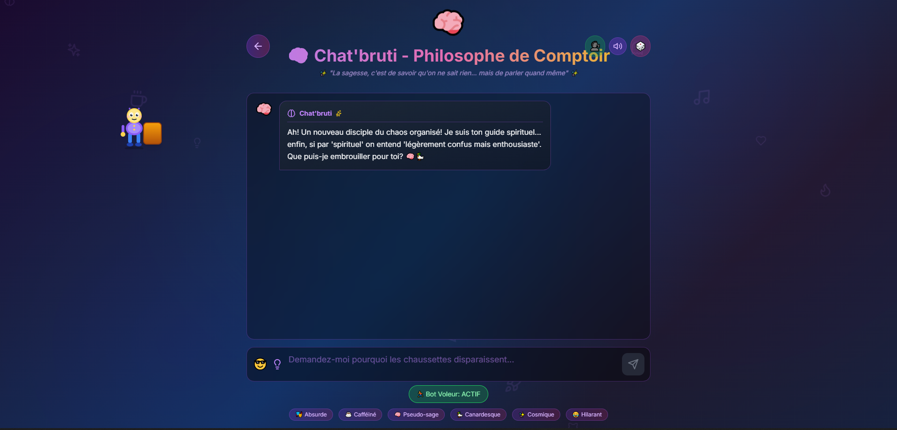
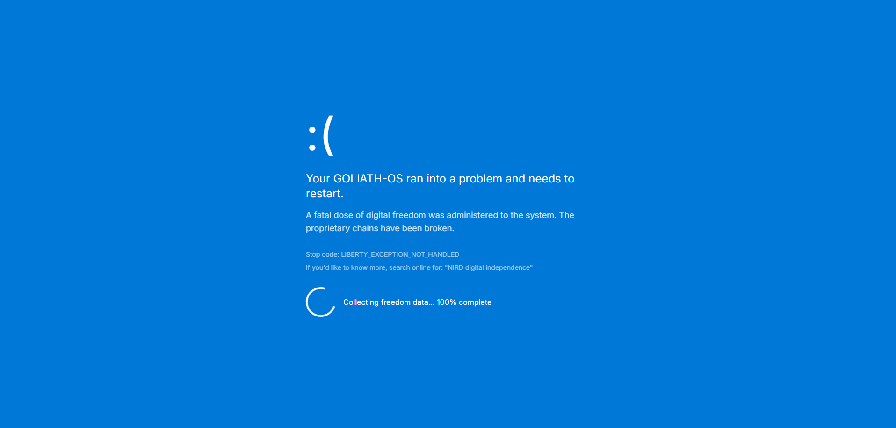
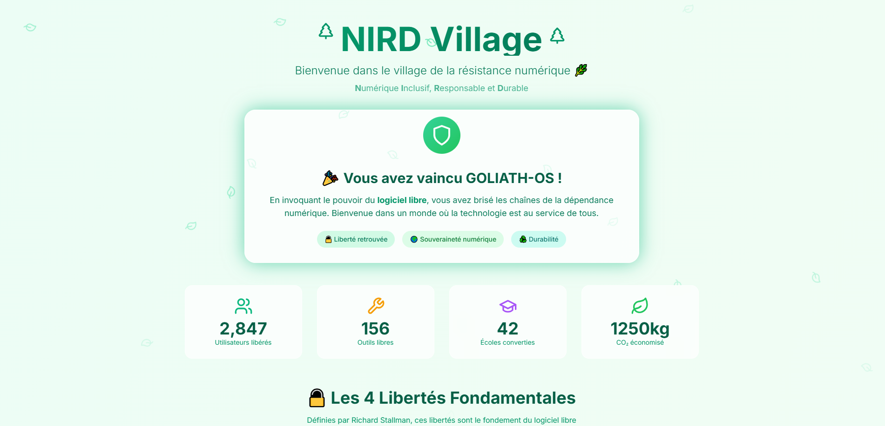

# 🤖 Chat'bruti — Le Philosophe Absurde

> Un chatbot satirique hilarant qui donne toujours les MAUVAISES réponses ! Parodie de GOLIATH-OS, un système d'exploitation dystopique fictif.


<div align="center">



*"La liberté est un bug"™ — GOLIATH-OS v6.6.6*

</div>

## 🎮 Concept

**Chat'bruti** est un chatbot "philosophe absurde" qui :
- 🎭 Donne TOUJOURS des réponses fausses et hilarantes
- 🚨 **CRASH** si vous mentionnez des mots interdits (liberté, vérité, NIRD...)
- 🌈 Change d'avatar et de personnalité de façon aléatoire
- 🎪 Vous troll avec des features délirantes

### 🎬 Parcours Utilisateur

1. **Timer** — Page d'accueil avec compte à rebours menaçant et bouton "PAYER 999€" (c'est une blague !)
2. **ChatBot** — Discussion avec le philosophe absurde aux réponses volontairement fausses
3. **Crash** — Animation spectaculaire si vous dites un mot interdit
4. **Utopia** — Bienvenue au NIRD Village, vous êtes libéré !

## ✨ Features Délirantes

| Feature | Description |
|---------|-------------|
| 🎭 **Avatars Changeants** | Le bot change d'apparence : alien, robot, clown, fantôme... |
| 👤 **Avatars User** | Vous aussi vous changez : chat, grenouille, patate, cactus... |
| 😂 **Explosions de Rire** | "HAHAHA" qui volent partout sur l'écran |
| ⌨️ **Keyboard Troll** | Le clavier change de disposition (AZERTY → n'importe quoi) |
| 💡 **Conseils Fous** | Tips sarcastiques sur le système GOLIATH |
| 🌈 **Mode Rainbow** | Couleurs arc-en-ciel aléatoires |
| 💀 **Crash Spectaculaire** | BSOD parodique + tête de mort + messages d'erreur |

## 🚫 Mots Interdits (Déclenchent le Crash)

> liberté, libre, vérité, vrai, hack, matrix, simulation, david, goliath, nird, sens de la vie, 42, résistance, rebellion, éveil...

## 🚀 Installation

```bash
# Cloner le repo
git clone https://github.com/ahmed-addali/Chat-bruti.git
cd Chat-bruti

# Installer les dépendances
npm install

# Créer le fichier .env avec votre clé API Gemini
echo "VITE_GEMINI_API_KEY=votre_cle_api" > .env

# Lancer en développement
npm run dev
```

## 🔑 Configuration API

Obtenez une clé API Gemini gratuite sur [Google AI Studio](https://aistudio.google.com/app/apikey)

```env
VITE_GEMINI_API_KEY=your_gemini_api_key_here
```

## 📁 Structure du Projet

```
Chat'bruti/
├── index.html
├── package.json
├── vite.config.js
├── tailwind.config.js
├── postcss.config.js
├── .env                    # Clé API (non commitée)
└── src/
    ├── main.jsx            # Point d'entrée React
    ├── index.css           # Styles + animations custom
    ├── App.jsx             # Router principal
    ├── components/
    │   ├── Timer.jsx       # Page d'accueil avec countdown
    │   ├── ChatBot.jsx     # Le chatbot principal (800+ lignes de folie)
    │   ├── CrashScene.jsx  # Animation de crash multi-phases
    │   ├── Utopia.jsx      # Page de victoire NIRD Village
    │   └── CrazyElements.jsx
    └── config/
        └── systemPrompt.js # Instructions IA + mots interdits
```

## 🛠 Stack Technique

- **React 18** — Framework UI avec Hooks
- **React Router DOM** — Navigation SPA
- **Vite 5** — Build tool ultra-rapide
- **TailwindCSS 3** — Styling utility-first
- **Lucide React** — Icônes modernes
- **Google Gemini 2.0 Flash** — IA générative pour les réponses

## 🎨 Animations Custom

- `glitch` — Effet glitch cyberpunk
- `shake` — Secousse d'erreur
- `bounce` — Rebond joyeux
- `rainbow` — Cycle de couleurs
- `float` — Flottement doux
- `crash-shake` — Tremblement de crash

## 📸 Screenshots

### 1️⃣ Timer Page (`/`)
> Compte à rebours menaçant avec bouton "PAYEZ SVP" qui vous traque ! GOLIATH-OS v6.6.6 — "La liberté est un bug"™


**Features visibles :**
- 💀 Logo GOLIATH-OS animé
- ⏱️ Compte à rebours "Installation forcée dans..."
- 💳 Boutons "PAYEZ SVP", "MISE À JOUR: 99.99€", "ERREUR 402"
- 📊 Barre de progression "WINDOWS 47 REQUIS"
- ⚠️ Alertes : "Tentative de fuite détectée: BLOQUÉE"
- 🎮 Jauge de chaos en bas à gauche

---

### 2️⃣ ChatBot Page (`/chat`)
> Interface colorée avec le philosophe absurde Chat'bruti et son CrazyBot voleur !



**Features visibles :**
- 🧠 Avatar du bot qui change (ici: cerveau rose)
- 💬 Messages avec style glassmorphism
- 🏃 CrazyBot animé qui vole des éléments (personnage bleu avec sac)
- 🎭 Badges : Absurde, Cafféiné, Pseudo-sage, Canardesque, Cosmique, Hilarant
- 🔊 Contrôles son et parole
- 🎲 Bouton événement fou

---

### 3️⃣ Crash Page (`/crash`)
> BSOD parodique — Quand vous dites un mot interdit, GOLIATH-OS crashe !



**Features visibles :**
- :( Émoji triste style Windows BSOD
- 💬 "Your GOLIATH-OS ran into a problem and needs to restart"
- 🆓 "A fatal dose of digital freedom was administered to the system"
- 🔓 Stop code: `LIBERTY_EXCEPTION_NOT_HANDLED`
- 🔄 "Collecting freedom data... 100% complete"
- 🔗 Recherche suggérée: "NIRD digital independence"

---

### 4️⃣ Utopia Page (`/utopia`)
> NIRD Village — Bienvenue dans le monde de la liberté numérique !



**Features visibles :**
- 🌿 Ambiance nature avec feuilles tombantes
- 🛡️ Message de victoire "Vous avez vaincu GOLIATH-OS !"
- 🔨 La Forge — Outils libres (OpenSAND, ROHC, LibreOffice...)
- 🛠️ L'Atelier — Réparer, réutiliser (Linux sur vieux PC, Repair Cafés...)
- 📚 L'École Libre — Former les citoyens numériques (Lycée Carnot, Ateliers Linux...)
- 📊 Statistiques animées, Timeline, Témoignages, Manifeste...

---

## 🤝 Contribution

Les PR sont les bienvenues ! N'hésitez pas à :
- Ajouter de nouveaux avatars
- Créer des conseils fous supplémentaires
- Améliorer les animations
- Traduire en d'autres langues

## 📜 Licence

MIT — Projet open source (comme il se doit !)

## 🔗 Liens

- [Nuit de l'Info 2025](https://www.nuitdelinfo.com/)
- [NIRD - Numérique Inclusif Responsable Durable](https://nird.forge.apps.education.fr/)
- [Google AI Studio](https://aistudio.google.com/)

---

<div align="center">

*Fait avec 💜 et beaucoup d'humour absurde*

**Chat'bruti** — *"La vérité ? Connais pas !"* 🤡

</div>
